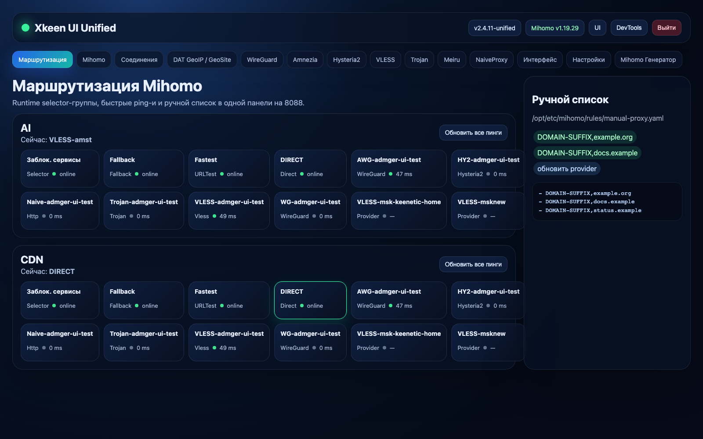

# Unified UI

**Unified UI** — самостоятельная панель управления для Keenetic + Entware + Mihomo. Это уже не форк чужой панели, а единый интерфейс для маршрутизации, selector’ов, подписок, подключений, DAT GeoIP/GeoSite и managed proxy-подключений.

Цель простая: одна панель на `8088`, без отдельного Zashboard для базовых операций, без ручного YAML через SSH и без “а где оно теперь переключается?”.

> Панель рассчитана на локальную сеть. Не публикуйте её напрямую в интернет без отдельной авторизации или reverse-proxy auth. Роутер — не то место, куда стоит приглашать весь интернет на чай.

---

## Скриншоты

### Маршрутизация Mihomo



### Селекторы плитками


### Селекторы списком


### Подключения по протоколам


### Соединения и DAT GeoIP / GeoSite


---

## Репозитории

| Что | Репозиторий |
|---|---|
| Unified UI | [`sllikmll/Unified-UI`](https://github.com/sllikmll/Unified-UI) |
| Mihomo fork/assets | [`sllikmll/mihomo`](https://github.com/sllikmll/mihomo) |
| Mihomo upstream | [`MetaCubeX/mihomo`](https://github.com/MetaCubeX/mihomo) |

В конфигурации и коде используются только репозитории `sllikmll/*` и публичный upstream Mihomo.

---

## Возможности

### Единая панель на `8088`

| Раздел | Что делает |
|---|---|
| **Маршрутизация** | Runtime-переключение selector-групп Mihomo, режим плиток/списков, ping одного узла и всех узлов |
| **Mihomo** | Редактирование активного `config.yaml`, обновление подписок, YAML-инструменты |
| **Соединения** | Активные Mihomo connections, фильтрация, детали, принудительный разрыв соединений |
| **DAT GeoIP / GeoSite** | Обновление, просмотр состава, работа с локальными списками/rule-provider payload |
| **WireGuard / Amnezia / Hysteria2 / VLESS / Trojan / Meiru / NaiveProxy** | Импорт подключений ссылкой или файлом и добавление в selector’ы |
| **Mihomo Генератор** | Встроенный генератор конфига без iframe и без отдельной страницы |

### Runtime selectors

Вкладка **Маршрутизация** работает с Mihomo API напрямую:

- режим **Плитки** — карточки нод/служебных proxy;
- режим **Списки** — компактные строки `selector + dropdown`, чтобы много групп помещалось на одной странице;
- ping рядом с узлом;
- клик по ping обновляет задержку конкретного узла;
- кнопка обновления всех ping’ов;
- поддержка provider-нод из `/providers/proxies`;
- inspector rule-provider показывает конечный payload, включая decoded `.mrs` cache, где это возможно.

### Managed proxy-подключения

Вкладки протоколов позволяют добавлять подключения вручную:

- **WireGuard** — `.conf` / `wireguard://`, injection как `type: wireguard`;
- **Amnezia / AWG** — `.conf`, WireGuard-compatible outbound, AWG-метаданные сохраняются в registry;
- **VLESS** — `vless://`, injection как `type: vless`;
- **Trojan** — `trojan://`, injection как `type: trojan`;
- **Hysteria2** — `hy2://` / `hysteria2://`, injection как `type: hysteria2`;
- **NaiveProxy** — `naive+https://`, HTTP/TLS outbound;
- **Meiru** — staging/registry для внешнего runtime, без native Mihomo injection.

Registry хранится на роутере:

```text
/opt/var/lib/xkeen-ui/proxy-connections.json
```

Mihomo-supported подключения вставляются в активный `config.yaml` между маркерами:

```yaml
# xkeen-managed-proxies:start
# ... generated proxy list ...
# xkeen-managed-proxies:end
```

При удалении подключения Unified UI должен автоматически:

1. удалить запись из registry;
2. удалить generated proxy из managed-блока;
3. удалить имя proxy из selector-групп;
4. применить config;
5. реально перезапустить Mihomo;
6. проверить, что runtime перечитал конфиг.

Restart считается успешным только если PID Mihomo изменился. Просто “процесс всё ещё жив” — не успех, а дешёвый фокус.

---

## Установка

На Keenetic с Entware:

```sh
cd /opt
curl -fL -o unified-ui-routing.tar.gz \
  "https://github.com/sllikmll/Unified-UI/releases/latest/download/unified-ui-routing.tar.gz"
tar -xzf unified-ui-routing.tar.gz
cd xkeen-ui
sh install.sh
```

После установки панель обычно доступна на:

```text
http://<IP_роутера>:8088/
```

Если `8088` занят, installer попробует запасные порты.

---

## Release asset

Основной архив:

```text
unified-ui-routing.tar.gz
```

Latest:

```text
https://github.com/sllikmll/Unified-UI/releases/latest/download/unified-ui-routing.tar.gz
```

Checksum:

```text
https://github.com/sllikmll/Unified-UI/releases/latest/download/unified-ui-routing.tar.gz.sha256
```

---

## Что ставит installer

`install.sh` ставит UI и runtime-части одной сборкой:

- Python-панель Flask/gevent;
- bundled wheelhouse для Python-зависимостей с fallback во внешний PyPI;
- standalone Mihomo core;
- layout `/opt/etc/mihomo`;
- symlink `config.yaml -> profiles/default.yaml`;
- `/opt/etc/mihomo/restart-mihomo.sh`;
- env-команды validate/restart для панели;
- optional `xk-geodat`;
- optional proxy-client artifacts для внешних runtime;
- init-сервис `/opt/etc/init.d/S99unified-ui001`.

Отключить установку Mihomo:

```sh
XKEEN_INSTALL_MIHOMO=0 sh install.sh
```

Принудительно переустановить Mihomo:

```sh
XKEEN_INSTALL_MIHOMO_FORCE=1 sh install.sh
```

Задать repo/tag Mihomo:

```sh
XKEEN_MIHOMO_REPO=sllikmll/mihomo \
XKEEN_MIHOMO_TAG=v1.19.29 \
sh install.sh
```

---

## Обновление

Через панель:

```text
Настройки → Проверить обновления → Установить
```

Или вручную:

```sh
/opt/etc/xkeen-ui/scripts/update_xkeen_ui.sh
```

Для ручного выбора repo/channel:

```sh
XKEEN_UI_UPDATE_REPO=sllikmll/Unified-UI \
XKEEN_UI_UPDATE_CHANNEL=main \
/opt/etc/xkeen-ui/scripts/update_xkeen_ui.sh
```

---

## Важные пути

| Путь | Назначение |
|---|---|
| `/opt/etc/xkeen-ui` | Код панели |
| `/opt/var/lib/xkeen-ui` | State/registry |
| `/opt/etc/mihomo/config.yaml` | Активный config Mihomo |
| `/opt/etc/mihomo/profiles/default.yaml` | Default profile |
| `/opt/etc/mihomo/rules/manual-proxy.yaml` | Ручной список |
| `/opt/etc/mihomo/restart-mihomo.sh` | Реальный restart Mihomo |
| `/opt/etc/init.d/S99unified-ui001` | Init-сервис панели |

---

## Разработка

Локальная проверка:

```sh
python3 -m py_compile xkeen-ui/app_factory.py
python3 -m pytest -q tests/test_xkeen_service_control_fallback.py tests/test_proxy_connections_cleanup.py tests/test_app_routes_smoke.py
npm run frontend:build
node scripts/verify_frontend_build.mjs
```

Сборка release-архива:

```sh
python3 scripts/build_user_archive.py \
  --skip-frontend-build \
  --version 2.4.x-unified \
  --update-url https://github.com/sllikmll/Unified-UI/releases/download/v2.4.x-unified/unified-ui-routing.tar.gz
```

---

## Статус

Unified UI активно развивается под реальный Keenetic/Entware сценарий. Главный приоритет — чтобы кнопки в панели делали реальные действия на роутере, а не просто красиво врали в toast’ах.
